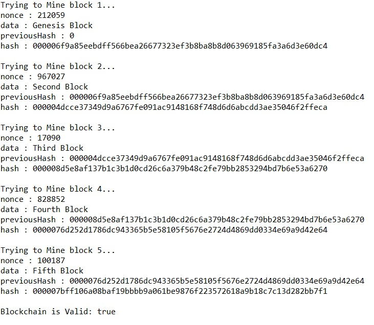

## 해시란? 

1. 뭘 넣든 같은 길이의 알수 없는 난수가 결과로 출력이 된다
   ex) 1, abcdefg...z => 동일한 길이의 난수

|  해시   | 자릿수 |
| :-----: | :----: |
|   MD5   |   32   |
|  SHA-1  |   40   |
| SHA-256 |   64   |
| SHA-512 |  128   |

2. 글자가 한글자만 바뀌어도 완전히 다른 결과가 출력이 된다

3. 출력값으로 입력값을 예측할 수 없다.

## 사용 분야

1. DB / User의 Password 저장 시

2. 복제 문서 판별 / 버전관리나 문서 복제등을 체크
3. 검색 용도 / 문자를 숫자나 저장되는 주소로 치환하여 검색에 사용되는 사례도 있음

## 결과

5개를 돌려보았음

ps. 채굴 시 유효성 검사 3개를 진행함

			if(!currentBlock.hash.equals(currentBlock.calculateHash()) ){
				System.out.println("현재 해시가 일치하지 않음");			
				return false;
			}
			
			if(!previousBlock.hash.equals(currentBlock.previousHash) ) {
				System.out.println("이전 해시와 일치하지 않음");
				return false;
			}
			
			if(!currentBlock.hash.substring(0, difficulty).equals(hashTarget)) {
				System.out.println("채굴된 적 없는 블럭임");
				return false;
			}
